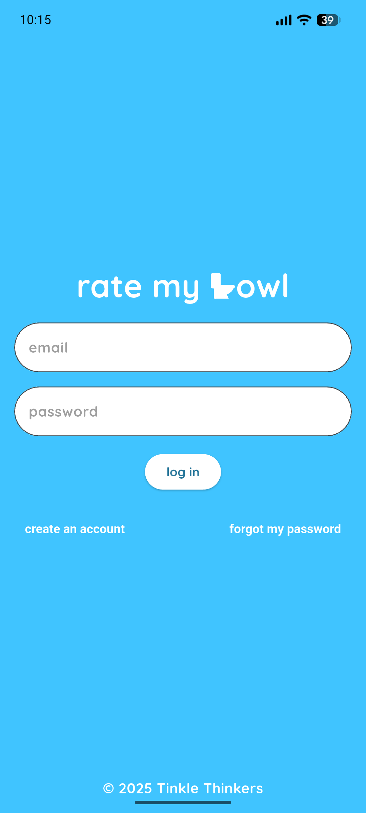
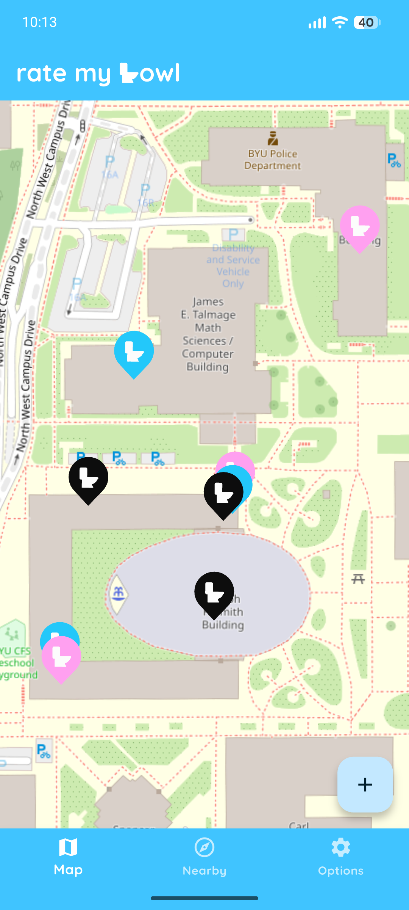
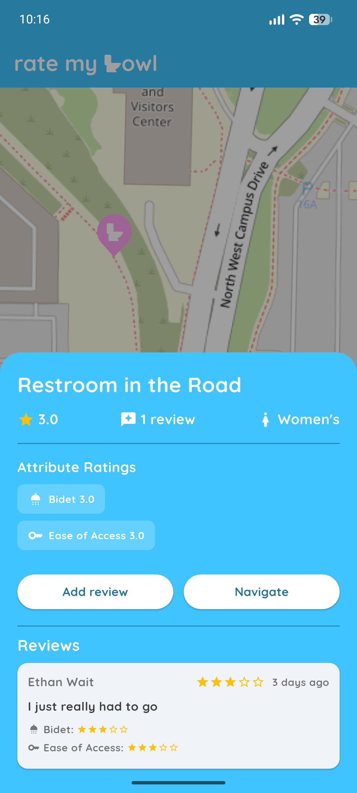
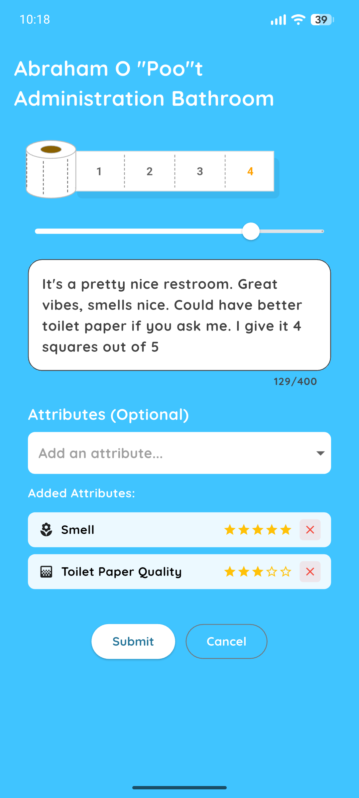
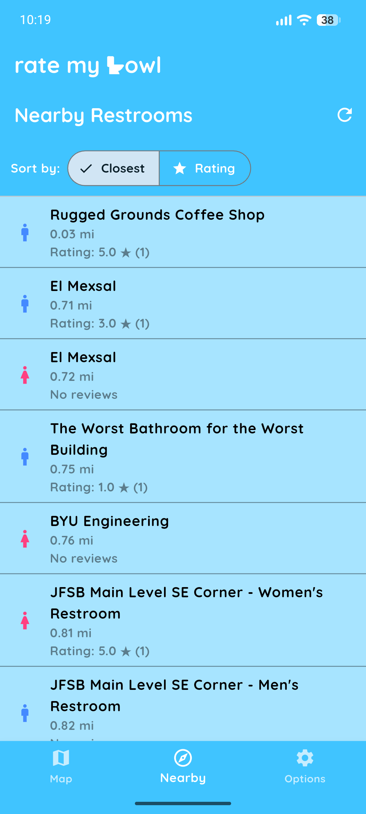
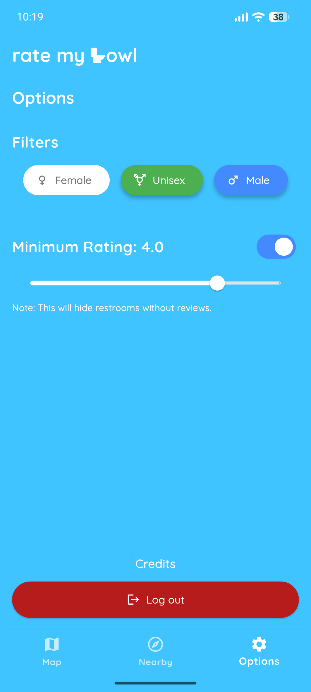

# 🚽 Rate My Bowl 🧻

By the Tinkle Thinkers

*Rest in That Room*™

Everyone has been through the pain of having to use a subpar restroom. It always goes the same way: I walk in, have one look at the bathroom, and think "Dang, I should have gone somewhere else. But what's the point? I'm already here". But NO MORE! Now, with this app, and the help of all who contribute ratings, I will finally be able to rest in that room.

## Summary of features

Rate, review, and discover public restrooms on the go! The purpose of this app is to help you find just the right restroom for your needs. You can also report on restrooms that you have visited, including rating each one up to 5 stars on the following metrics:

- Baby Changing Station
- Bidet
- Ease of Access
- Feminine Hygiene Products
- Hand-Drying Options
- Smell
- Toilet Paper Quality
- Wheelchair Accessibility

There is a map screen where you can freely pan around and see what's near you. This is great for when you need to find something quick!

If you want to be more careful about where you go, there is a "Near Me" screen that lets you more easily compare features and reviews of nearby restrooms.

If you're having a hard time finding the one for you, check out the "Options" screen, where you can apply filters for what you see in either of the other screens.

## Screenshots

| Login Screen | Map Screen | Reviews Popup |
| - | - | - |
|  |  |  |

| Review Screen | Nearby Screen | Options Screen |
| - | - | - |
|  |  |  |

## Dev Environment

- `git clone https://github.com/pgattic/ratemybowl && cd ratemybowl`
- Ensure a Supabase backend is prepared, can copy the contents of `schema.sql` into it for correct initialization (or just build local version, see [Backend Modes](#backend-modes)).
- Add Supabase auth keys to `.env` file at root of repo, containing the keys `SUPABASE_URL`, `SUPABASE_KEY`, and `DATABASE_PASSWORD` (if using Supabase backend)

### Nix (with Flakes enabled)

- `nix develop`

This will provide a dev shell with a preconfigured Android emulator and system image, Flutter, Android SDK and cmdline-tools, and more. Thanks to PlayXDead for his awesome [example flake](https://github.com/PlayXDead/nix-flake-flutter-android-dev-env), off of which ours is based ([Reddit post](https://www.reddit.com/r/NixOS/comments/1ngt889/my_first_flake_flutterandroid_dev_enviroment_with/)).

### Windows

- Follow the Windows instructions in the [Flutter Get Started](https://docs.flutter.dev/get-started) documentation

### MacOS

- Follow the MacOS instructions in the [Flutter Get Started](https://docs.flutter.dev/get-started) documentation

### Backend modes

The app can be compiled to run against either Supabase or a fully offline SQLite database. By default Supabase is used, but you can swap backends at compile time with the `USE_SUPABASE` flag:

```bash
# For normal (Supabase) version
flutter run
flutter build apk

# For local-only (SQLite) version
flutter run --dart-define=USE_SUPABASE=false
flutter build apk --dart-define=USE_SUPABASE=false
```

When `USE_SUPABASE=false`, the app boots a local SQLite database that mirrors the schema defined in `schema.sql`, seeds a few default restrooms, and includes a demo account (`demo@ratemybowl.app` / `Password123`). You can sign up for additional offline accounts and everything (reviews, new restrooms, auth state) is stored locally so it works without a network connection.

## Contributing

- Before making any pull requests to `master`, ensure that you are able to run `flutter clean` and `flutter run` without any compilation issues or instant crashes. Thank you!

